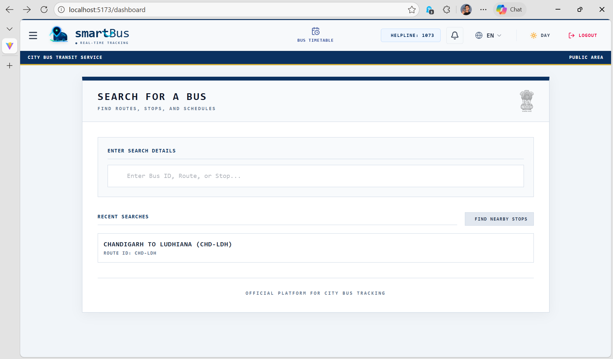
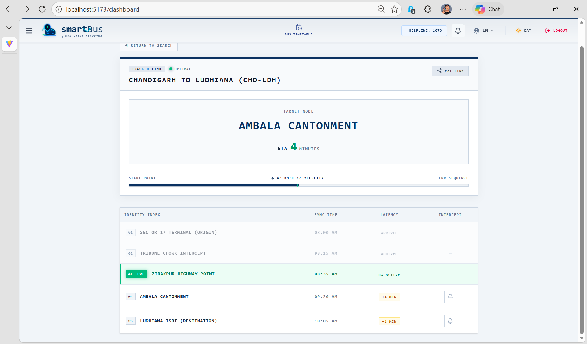
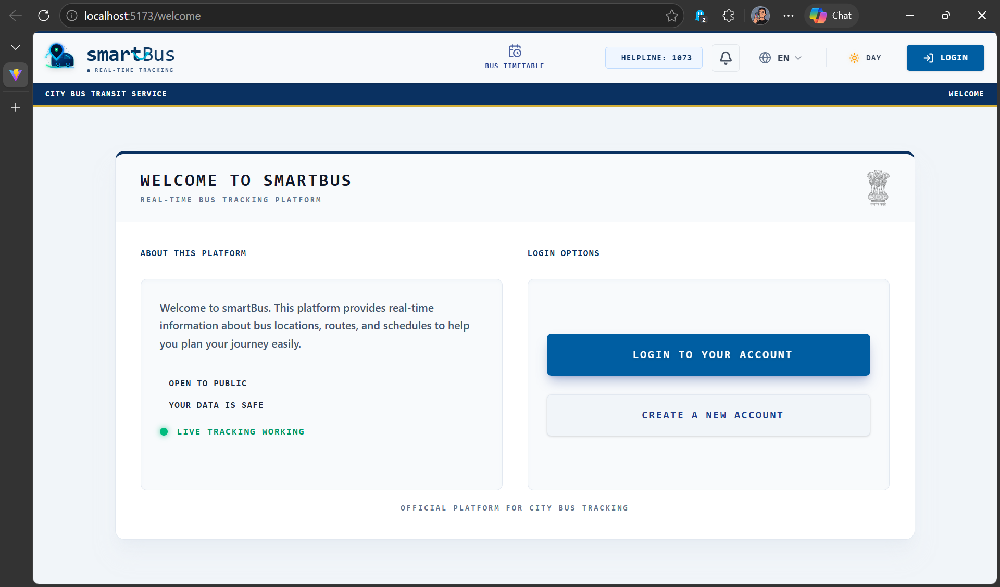
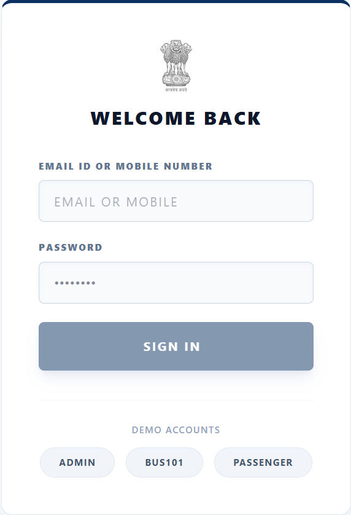

# 🚌 smartBus

> Real-Time Public Transport Tracking & Transit Intelligence Platform

[](https://reactjs.org/)
[](https://vitejs.dev/)
[](https://leafletjs.com/)

smartBus is a capstone project focused on improving urban public transportation through real-time transit monitoring, route visualization, and ETA prediction. The platform is designed with a modern government-grade interface to provide commuters with an efficient and intuitive transit experience.

---

## ✨ Features

- 📍 Real-time bus tracking with interactive maps
- ⏱ ETA prediction and route visualization
- 🌓 Adaptive Light/Dark theme
- ⚡ Smooth UI animations and transitions
- 📱 Fully responsive mobile-first design
- 🔐 Role-based dashboards *(In Development)*

---

## 📸 Preview

| Dashboard | ETA Prediction |
|---|---|
|  |  |

| Landing Page | Login |
|---|---|
|  |  |

---

## 🛠 Tech Stack

### Frontend
- React.js + Vite
- Leaflet.js
- OpenStreetMap
- Framer Motion
- CSS3

### Backend *(Under Development)*
- Node.js
- Express.js
- MongoDB
- JWT Authentication

---

## 🚀 Getting Started

### Prerequisites

- Node.js (Latest LTS)
- npm or yarn

### Installation

```bash
git clone https://github.com/NishadSharma/smartBus.git
cd smartBus
npm install
npm run dev
```

### Run Locally

```bash
http://localhost:5173
```

---

## 📂 Project Structure

```bash
smartBus/
├── public/
├── screenshots/
├── src/
├── package.json
└── README.md
```

---

## 📌 Project Status

| Module | Status |
|---|---|
| Live Transit Dashboard | ✅ Completed |
| Animated Bus Tracking | ✅ Completed |
| ETA Prediction UI | ✅ Completed |
| Backend Integration | 🚧 In Progress |
| Admin Dashboard | ⏳ Planned |
| Driver GPS Integration | ⏳ Planned |

---

## 📑 Research & Innovation

- 📄 Research paper prepared *(currently under review / not yet accepted)*
- 🏛 Patent filed and approved at university level

---

## 🔗 Project Links

- [Figma Design](https://www.figma.com/design/HBes82ZYORR1es0prPHoLd/punbus-website-design?node-id=0-1&t=Xs8OiWMqBlkxNjxR-1)
- [Issue Tracker](https://github.com/NishadSharma/smartBus/issues)

---

## 👨‍💻 Author

**Nishad**  
Scool of Computer Science & Engineering
Lovely Professional University, Phagwara
Punjab, India

---

## ⚠️ Disclaimer

This project is developed as an academic capstone project.  
All transit movement data and ETA information currently displayed are simulated for demonstration and research purposes only.
